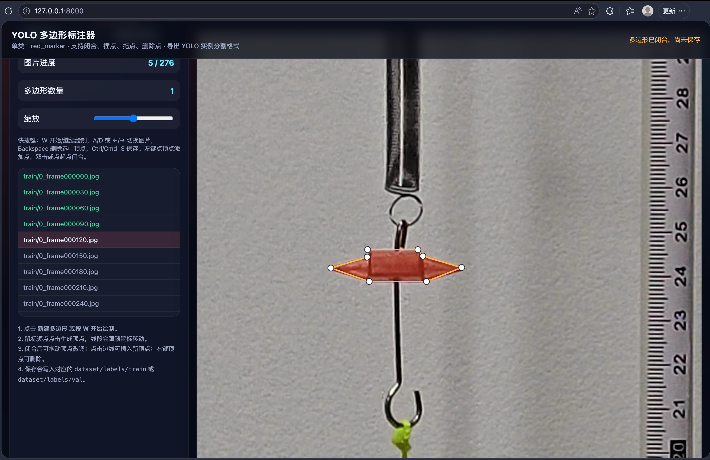

# 数算大作业

## 0.前言
这学期的数算学习有点失败，机考仅仅AC3。由于参加了CUPT的校赛，同时进入校队，自己大部分时间都投入于实验之中。对于入学没有计算机基础，学习能力也相对较差的我来说，如果没有给数算分配很多的时间，结果不好或许是必然的。这学期虽然比较模板化，但是依然需要大量刷题才能得到好成绩，但是自己只是局限于作业中不超纲的内容、一些比较简单、生搬硬套的模板题，而且模考线下参加的较少，所以考试手感下降，或许也是导致被栽在签到题上、心态波动导致难题也没写对的原因吧。

不过这学期我在参与实验的过程中，同样学习了很多数据处理、ai的内容，下面的大作业就是其中一个我最喜欢的内容。

背景：A magnet suspended by a spring will display simple harmonic motion when displaced. If the magnet oscillates within a coil connected to a resistor, its motion will be damped. Investigate the factors that affect the damping.

实验中我们录制了长视频，要追踪弹簧振子的竖直位移。一开始我们使用一个红色标记，尝试用opencv来实现颜色的识别，追踪标记的运动。可是当时对于这类追踪经验甚少，写的算法不够好，追踪效果并不好。帧数过少导致的虚影、环境中的杂光干扰，使得我们经常识别不到标记。

后面了解到YOLO可以通过输入训练集和验证集，达到很好的追踪效果。在系统学习之后，有了下面的工作。将其中的物理内容刨去，就得到了大作业。（尽管最后的最后，我们优化了算法，还是使用opencv进行了追踪，但是yolo的学习无疑是珍贵的）

什么是 YOLO？YOLO（You Only Look Once，意为“一次看完”）：统一的实时目标检测，是由 Joseph Redmon 在 CVPR 2016 上发表的一种单阶段目标检测模型，以低延迟和高精度著称。目标检测是计算机视觉中的一项重要任务。通俗地说，目标检测可以定义为“目标定位 + 目标分类”。其中，目标定位是指使用边界框在图像中找到目标的位置；目标分类则是识别边界框内的对象具体是什么。在我的大作业中，我们只需要对目标进行定位。

目标检测在现实生活中有诸多应用。例如，在自动驾驶领域，它用于检测车辆、行人、车道边界预测、高精度地图（HD-Map）生成、交通信号灯和交通标志等。在安防监控中，它可用于检测入侵者、车牌、人脸口罩识别、武器检测等。在生物识别考勤系统中也有应用。在医学影像中，目标检测可用于检测特定细胞、癌症、肿瘤等。实际上，目标检测的应用场景非常广泛，远不止上述列举的这些。

本项目基于 YOLO 完成红色标识物的检测、轨迹提取。整体流程分为数据集生成、模型训练、视频推理和物理量换算四步。

## 1. 项目

### 1.1 视频抽帧与数据集构建

先从原实验视频中等间隔抽取单帧图像，构建训练数据集。针对单一目标追踪，通常抽取 100 到 300 帧具有代表性的图像即可。

- 使用 OpenCV 按固定间隔读取视频并保存为 `.jpg` 图像。
- 优先保留包含红色标识物不同状态的图片，例如静止、运动模糊、不同形变和不同背景位置。
- 在项目根目录下建立 YOLO 所需的数据集目录：

```text
dataset/
├── images/
│   ├── train/
│   └── val/
└── labels/
    ├── train/
    └── val/
```

对应脚本：`scripts/extract_frames.py`

### 1.2 图像标注与标签整理

接着对抽帧图片进行标注，生成 YOLO 格式的标签文件。

- 打开标注工具（by the way，可以提一下这个标注工具，一开始我是用labelimg进行标注的，但是这样要把标注工具封装到大作业中就会比较麻烦，而且有许多冗余功能是这里不需要的，所以这里我使用了本地的标注页面，通过 Python 启一个本地 HTTP 服务，再用 HTML、CSS 和 JavaScript 组织交互界面，这样既方便离线使用，也更适合批量处理自己的数据。），对红色标识物框选或多边形标注。

- 将类别统一命名为 `red_marker`。
- 标注完成后，把标签文件按训练集/验证集划分到 `labels/train/` 和 `labels/val/`。
- 如果标签文件格式需要清洗或重新归档，可以使用脚本批量整理。

对应脚本：
- `scripts/browser_polygon_annotator.py`：多边形标注网页工具
- `scripts/clean_yolo_labels.py`：标签清洗与归档

### 1.3 配置训练环境与模型训练

在项目根目录创建 `dataset.yaml`，定义数据路径和类别：

```yaml
path: ./dataset
train: images/train
val: images/val
nc: 1
names: ['red_marker']
```

训练脚本会调用 Ultralytics YOLO，并在 Mac 上显式指定 `mps` 设备以加速训练。

```python
from ultralytics import YOLO

model = YOLO('yolov8n-seg.pt')
results = model.train(
    data='dataset.yaml',
    epochs=100,
    imgsz=640,
    device='mps',
    batch=16,
    project='marker_tracking',
    name='run_1'
)
```

训练完成后，最佳权重（权重指在大规模数据集上训练得到的模型参数，这些权重能够学习通用的特征模式，如边缘、纹理、形状等，从而帮助模型更快收敛并提高泛化能力），位于：

```text
marker_tracking/run_1/weights/best.pt
```

对应脚本：`scripts/train_yolo.py`

### 1.4 视频推理与轨迹坐标提取

训练完成后，使用最佳权重对完整视频逐帧推理，提取红色标识物的边界框和中心点。

YOLO 默认输出边界框坐标为：

$$[x_{min}, y_{min}, x_{max}, y_{max}]$$

中心点计算公式为：

$$x_{center} = \frac{x_{min} + x_{max}}{2}$$

$$y_{center} = \frac{y_{min} + y_{max}}{2}$$

脚本会把每帧的边界框和中心点坐标保存成 CSV，方便后续绘图和分析。

对应脚本：`scripts/infer_trajectory.py`

### 1.5 像素坐标到真实物理量的转换

为了计算位移、速度或加速度，需要把像素坐标换算成物理坐标。

- 在画面中找到直尺上的两个已知刻度。
- 读取这两个刻度之间的像素距离 `D_pixel`。
- 结合真实距离 `D_real`，得到比例系数：

$$k = \frac{D_{real}}{D_{pixel}}$$

其中 `k` 的单位是 `mm/pixel`。

若以某一条参考线或某一点 `y_0` 作为零点，则第 `i` 帧的真实纵向位置为：

$$Y_{real} = (y_{center} - y_0) \times k$$

对应脚本：`scripts/convert_physical.py`

### 1.6 输出效果视频与位移时间曲线

如果你想直接看到处理结果，可以把检测框、中心点和位移曲线一起导出。

对应脚本：`scripts/export_tracking_results.py`

## 2. 项目结构与各模块作用

```text
.
├── dataset.yaml                # YOLO 数据集配置
├── dataset/                    # 数据集目录
├── outputs/                    # 推理结果、曲线图、预览图输出目录
├── requirements.txt            # Python 依赖
├── README.md                   # 项目说明
├── scripts/
│   ├── train_yolo.py           # 训练 YOLO 模型
│   ├── infer_trajectory.py     # 视频推理，导出轨迹 CSV
│   ├── convert_physical.py     # 像素坐标转物理坐标
│   ├── export_tracking_results.py  # 导出效果视频和位移曲线
│   ├── extract_frames.py       # 视频抽帧构建数据集
│   ├── clean_yolo_labels.py    # 标签清洗与归档
│   └── browser_polygon_annotator.py # 多边形标注工具
└── videos/                     # 原始视频
```

### 模块说明

- `dataset.yaml`：训练时的数据集配置文件。
- `scripts/train_yolo.py`：训练入口，负责生成 `marker_tracking/run_1/weights/best.pt`。
- `scripts/infer_trajectory.py`：对视频逐帧检测，输出轨迹中心点坐标。
- `scripts/convert_physical.py`：把像素轨迹换算成真实物理量。
- `scripts/export_tracking_results.py`：生成带检测框的效果视频和位移时间曲线。
- `scripts/extract_frames.py`：从视频中抽帧。
- `scripts/clean_yolo_labels.py`：清理和整理标签格式。
- `scripts/browser_polygon_annotator.py`：网页标注工具。

## 3. 使用方法

### 3.1 安装依赖

建议统一使用项目根目录下的虚拟环境：

```bash
./.venv/bin/python -m pip install -r requirements.txt
```

如果还需要生成曲线图或预览图，也要确保 `matplotlib` 已安装：

```bash
./.venv/bin/python -m pip install matplotlib
```

### 3.2 训练模型

这里我们已经有训练好了的训练集和验证集了，如果想更新，使用网页工具就好了。

```bash
./.venv/bin/python scripts/train_yolo.py --device mps
```

可选参数：

- `--epochs 100`
- `--imgsz 640`
- `--batch 16`
- `--name run_1`

### 3.3 视频推理

```bash
./.venv/bin/python scripts/infer_trajectory.py \
  --video source_video.mp4 \
  --weights marker_tracking/run_1/weights/best.pt \
  --device mps
```

输出默认保存在 `outputs/trajectory.csv`。

### 3.4 生成效果视频和位移曲线

```bash
./.venv/bin/python scripts/export_tracking_results.py \
  --video source_video.mp4 \
  --y0 320 \
  --k 0.5
```

输出目录中会包含：
- `annotated.mp4`
- `trajectory.csv`
- `displacement_curve.png`

这里我跑了5个，呈现很清晰的阻尼振动，追踪效果可以见视频。

### 3.5 像素转物理坐标

```bash
./.venv/bin/python scripts/convert_physical.py --k 0.5 --y0 320
```

## 关于运动模糊

红色标识物在剧烈运动时**通常会出现一定程度的边缘模糊**，尤其在曝光时间较长或运动速度较快的帧中更明显。这个现象会影响标注边界和检测稳定性，因此建议在标注时尽量包住模糊区域，并在训练时保留包含模糊的样本。

## 4.总结
尽管完成这个大作业后，回头看来，用YOLO处理标记追踪有点大炮打蚊子的感觉。但是我仍然学习了用YOLO解决问题的流程：训练、验证、使用。

